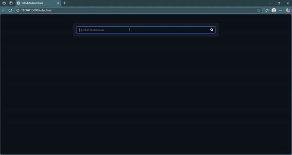

# 🔍 Github Profile Cards

This is a web application that fetches and displays a GitHub user's profile using the GitHub API. Just enter a username to view the profile photo, basic info, follower stats, and their latest repositories.

---

# ✨ Features

- Search GitHub users by username

- Display profile photo, name, username, and bio

- Show followers, following, and public repositories count

- Display the 3 most recent repositories

- Handles errors (e.g., user not found)

---

# 🛠️ Built With

- HTML5

- CSS3 (Responsive design)

- JavaScript 

- [Axios](https://axios-http.com/) – for HTTP requests

---

# 📸 Preview

 

